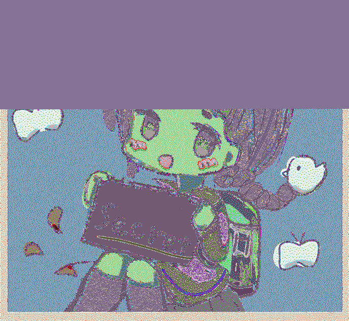
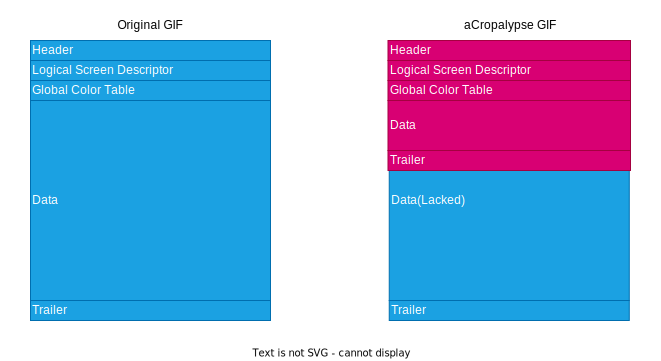
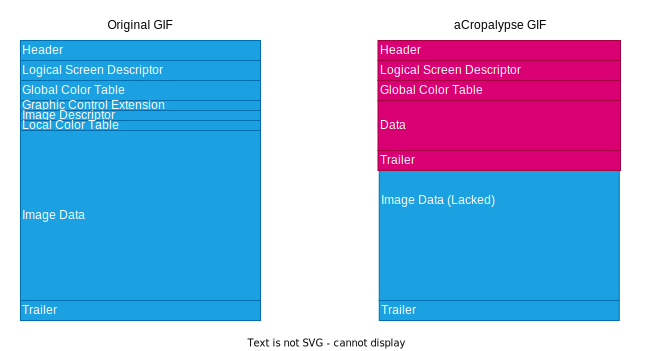
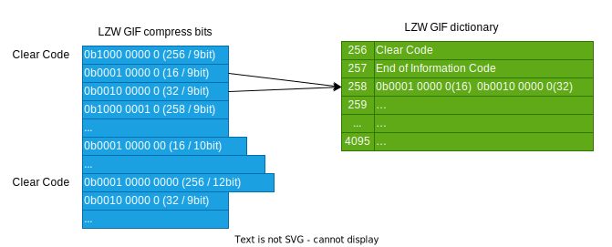
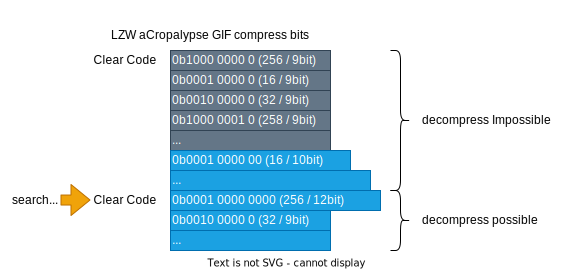

# Details of aCropalypse GIF vulnerability

Translated from [exploit_detail_ja.md](exploit_detail_ja.md) with [DeepL](https://www.deepl.com/translator)

## What is aCropalypse

aCropalypse is a software vulnerability discovered in March 2023. When aCropalypse vulnerable software overwrites a file, it appears as if the file has been successfully overwritten, but in fact some of the pre-written information remains. This could allow, for example, a portion of an image to be recovered from the information before it was overwritten.

For example, suppose you have an image file that contains the secret information `Secret`.


This is cut out with aCropalypse vulnerable software and saved over. On the image display, it appears that the image has been correctly cropped and the secret information before the overwrite has disappeared.


However, using only this cropped image and manipulating it with a specific tool yields the following image.



You will see that the secret information `Secret` that should have been clipped can be recovered.

This paper describes how to recover files affected by the aCropalypse vulnerability, especially in GIF images.

## aCropalypse binary structure

The aCropalypse vulnerable software saves incorrect binaries when overwriting files.

If the binary after overwriting is smaller than the binary before overwriting, a portion of the binary before overwriting remains in the file. Therefore, the file size before and after overwriting will be the same. This happens, for example, when an image is cropped and overwritten.


In the presence of such an illegal binary, the following considerations should be made

- (1-a) Can the boundary point between the overwritten binary and the pre-written binary be detected?
- (1-b) Is it possible to extract useful information from the pre-overwritten binary with the first one missing?

(1-a) is easy for common image binaries, like GIF. Most image file formats have explicit specifications for the end of the image file.

(1-b) may be difficult for some file format specifications. If the binary at the beginning is missing, and it is not known to what extent it is missing, then information important to the file may be missing. However, with PNG and GIF images, it has been shown that it is possible to recover parts of an image from a missing binary.

## aCropalypse PNG Recovery

The aCropalypse in PNGs is explained in detail on the discoverer's blog. see [Exploiting aCropalypse: Recovering Truncated PNGs](https://www.da.vidbuchanan.co.uk/ blog/exploiting-acropalypse.html).

In Deflate, which is used to compress PNG image data, multiple compressed blocks are often stored in the implementation. Therefore, even if the first few compressed blocks are missing, it is explained that subsequent compressed blocks can be decompressed once the first compressed block somewhere is located.


The above is a Deflate-specific problem for PNGs, but a similar approach can be used to restore GIFs.

## aCropalypse GIF Recovery

### Structure of GIF

aCropalypse To understand how to recover from a GIF, an understanding of the file format specification for GIF images is required. the exact details of the GIF specification can be found at [GIF89a Specification](https://www.w3.org/Graphics/GIF/spec-gif89a.txt) or read existing explanatory websites. Here, we will focus on the points necessary for restoration.

An approximate overall view of a GIF image is shown below. (For the sake of explanation, detailed rigor has been omitted.)

|name|size|explain|
|---|---|---|
|Header|6 byte|Fixed header `GIF87a` or `GIF89a` to indicate that it is a GIF.|
|Logical Screen Descriptor|7 byte|Various information on image display|
|Global Color Table|0 to 256*3 byte|Palette data for globals|
|Data|n byte|video data|
|Trailer|1 byte|GIF Termination|

The binary of the normal GIF and the aCropalypse GIF that overwrites it are compared below.



To make matters simpler, we will consider only the case where the GIF is a still image; the data structure changes when the GIF is a still image and when it is a GIF animation. The data structure of most still GIFs is as follows (For ease of understanding, the wording has been slightly changed from the exact specification.)

|name|size|explain|
|---|---|---|
|`Graphic Control Extension`|8 byte|GIF Animation Information|
|`Image Descriptor`|10 byte|Information about the image for one frame|
|`Local Color Table`|0 to 256*3 byte|Local palette data|
|`Image Data`|n byte|LZW-compressed image data in sub-blocks|

In the case of a GIF animation, the above is repeated multiple times. In the case of a still image, there is only one frame, so only one of each is stored. Because of this property, GIF animations may be easier to recover; in the case of GIF animations, it may be possible to recover subsequent data by finding the start of the `Graphic Control Extension` that is not missing, but this is not the case here. We exclude this case here.

In GIF images, `Image Data` is divided into sub-blocks. A subblock has the following structure

|name|size|explain|
|---|---|---|
|`Block Size`|1 byte|Size of Data Values|
|`Data Values`|(Block Size) byte|data body|

Within `Image Data`, the above sub-blocks will be repeated multiple times. For example, if the LWZ compressed image data is 600 bytes, it is divided into the following three sub-blocks.

- `0xFF` (Block Size / 1 byte) 0xFF = 255
- ... (Data Values / 255 byte)
- `0xFF` (Block Size / 1 byte) 0xFF = 255
- ... (Data Values / 255 byte)
- `0x5A` (Block Size / 1 byte) 0x5A = 90 600 - 255*2
- ... (Data Values / 90 byte)

One might wonder about the specification that in 2023, a single subblock is limited to a mere 255 bytes. However, since this was formulated in the 1980s, when networks and computers were far less powerful than they are today, this size was reasonable (probably).

### Normal GIF decoding

Now that you understand the data structure of GIF, here is a simple example of decoding a normal still GIF file; there are already many references on GIF decoding, so you may want to refer to them for more details.

The flow is as follows

- Verify that the binary sequence is a GIF image from the `Header`.
- get information from `Logical Screen Descriptor` and `Image Descriptor` about the size of the image, etc.
- read a subblock of `Image Data` and merge the `Data Values` of the subblock
- extract the concatenated `Data Values` in LZW format
- convert the LZW-expanded data to RGB image based on `Global Color Table` or `Local Color Table` as an index image.

As is well known, GIF is an index color image format. Therefore, it is an index image, that is, it is the image data expanded. To display it as the image we normally see, it must be converted to an RGB image by combining the index and palette.

### Four issues for restoration

Now, the important part of the restoration is where the data from in the aCropalypse GIF remains. As you can imagine by looking at the sizes of the data structures described above, you can expect most still GIFs to have the binaries from the middle of the `Image Data`. This is because the data above that is small compared to the size of the `Image Data`. If the cropped image is very small, it is possible, but unlikely, that information prior to `Image Data` will be available.

In other words, the following is possible.



To recover an image from aCropalypse GIF, you will only use the first part of the missing `Image Data`. In recovering the image from this missing `Image Data`, the problem can be divided into four parts

- (2-a) Cannot tell where the `Image Data` is missing from.
- (2-b) In general LZW compression, if the first binary is missing, it cannot be decompressed.
- (2-c) I don't know the size of the image.
- (2-d) Missing palette information

Conversely, if the above issues can be resolved, the image can be restored. Let us consider each of them.

#### (2-a) Cannot tell where Image Data is missing from

It is obvious that we don't know where the `Image Data` is missing from, but what problem does this cause?

As I described the `Image Data` subblocks a while ago, in order to do LZW expansion, I need to remove the `Block Size` binaries and concatenate only the `Data Values`. In an `Image Data` with a missing head, it is simply not clear which are the `Block Size` and which are the `Data Values`.

However, in a reasonably large GIF image, it is expected to have a sequence of sub-blocks with a `Block Size` of `0xFF`. Therefore, the first step is to search for bytes of `0xFF`. Naturally, the `0xFF` binary also appears in `Data Values`, so we cannot identify it as a `Block Size` from a single `0xFF`. However, due to the nature of the subblock, if it is a `Block Size` of `0xFF`, then it is quite likely that the next `0xFF` bytes read are `0xFF`. If you repeat this reading and there is no inconsistency until you reach the `Trailer`, you can expect that the first `0xFFFF` you find is a `Block Size`.


Once the `Block Size` is identified by the above method, the `Data Values` can be combined to obtain the missing LZW compressed binary.

Incidentally, there are other ways to search. For example, it may be possible to go back to the Trailer and verify consistency. I didn't try it this time.

#### (2-b) In general LZW compression, if the first binary is missing, it cannot be decompressed.

Now, in general, it is virtually impossible to decompress an LZW compressed binary with a missing leading binary.

LZW compression is difficult to explain, so we recommend reading existing sites for details. Simply put, LZW creates dictionary data by reading binary sequences in sequence. Since the contents of the dictionary depend on the first binary sequence, a missing first binary will result in completely different data. In addition, the expansion is a bit-level operation, but the bit size to be read varies depending on the contents of the data, so it is not even possible to specify which position is the boundary.

However, LZW compression of GIFs has some additional specifications; the important ones for the nature of LZW compression of GIFs are the following

- The maximum length of a dictionary code is 12 bits (4095 codes)
- When the number of codes in the dictionary exceeds 4095, a `clear code` is output and the dictionary is initialized



The specifications of LZW compression create something called a dictionary. By referring to the dictionary data, the data can be compressed into smaller data. In GIF, the maximum length of the dictionary is defined, and when it is full, a special code called `clear code` is output to initialize the dictionary. After the dictionary is initialized, the binary sequence can be newly LZW decompressed, regardless of what kind of dictionary was created before that.

The point is that **as long as the location of the clear code can be identified, LZW decompression is possible** after that. LZW decompression is possible even if the first binary of the entire LZW compressed binary is missing, because the binaries after the clear code can be considered as separate LZW compressed binaries. When the dictionary is full, the clear code is often a bit string `0b0001_0000_0000`.

Note that the clear code may vary depending on the color depth of the image. Today, most GIFs should have a color depth of 8 bits. For GIFs with 8-bit color depth, the clear code is 256.



After estimating the bit value of the clear code, we simply search for the value of the clear code by shifting the missing LZW compressed binary by one bit. The bit sequence after the bit sequence that matches the clear code is considered LZW compressed data, and if LZW decompression succeeds, it may be image data. In fact, it often happens to be a binary sequence that is LZW decompressible, but if the data after decompression is large enough (e.g., larger than the data before decompression), it is likely to be the image data that you want to recover.

#### (2-c) I don't know the size of the image

As those familiar with processing image binaries are well aware, image data itself is a one-dimensional array. The resulting 1D array is simply used as the basis for displaying the image size. The image data alone does not tell us where the next line starts. Without at least the width information, it is impossible to know where to go to the next line.

Since `acropalypse-gif restore` asks you to enter the size of the original image, it doesn't actually solve this problem. However, we believe there is a solution.

Since we know the data sequence of the cropped image, we can identify the size of the original image by looking for a match in the restored data sequence. Of course, if the original data is a simple fill or regular data, it may not be possible to search for it, but if it is a general GIF image, it will definitely be possible to identify it.

#### (2-d) Missing information on palette

The data that could be LZW expanded is GIF index image data. To make this visible to the human eye, palette data is required. However, the palette data is lost.

However, this is a trivial problem compared to others. Even without palette data, shape estimation is possible with index data. If we prepare an appropriate palette and apply it to the image, we can roughly determine the shape of the image without reproducing it. If the image contains a string such as a password, the exact color is not important. As long as the shape is known, the password string can be identified.

A more advanced method would be to extrapolate from the palette and its image data after cropping. If the recovered data contains the post-crop sequence, then the palette should correspond to that part of the image. Since `acropalypse-gif restore` does not go that far, the restored image will have strange colors, but you will see that there is not much of a problem.

### Reconstruction Algorithm

To summarize the above, the algorithm to recover aCropalypse GIF is as follows

- Search for subblocks of `Image Data`. Subblocks start with `0xFF` to verify that they follow the GIF format.
- Search for a 12-bit clear code in GIF's LZW compression. This is a bit sequence of `0b0001000000000000`.
  - LZW decompress the binary after the above clear code.
- Estimate the width of the original image from the information in the cropped image.
- Recover the colors of the image using the palette of the cropped image.

## Detecting and Fixing aCropalypse Images

The `CVE-2023-21036` and `CVE-2023-28303` vulnerabilities in software that outputs aCropalypse images have now been fixed. However, your images published on the Internet may be aCropalypse images.

As a practical measure, you can correct aCropalypse images at hand. Basically, simply re-save any suspicious images. This is a common countermeasure for image vulnerabilities, which is also done for web services that allow images to be uploaded, etc.

In the case of PNGs, if there are multiple IEND binaries, it is likely that the image is aCropalypse image (and the image data may happen to contain data matching the IEND).

```sh
$ strings acropalypse.png | grep IEND
IEND
IEND
```

A safer alternative is to use [infobyte/CVE-2023-21036](https://github.com/infobyte/CVE-2023-21036).

In the case of GIF, the `Trailer` is only one byte, so it cannot be as simple as in PNG (it is two bytes, even if you include the 0x00 immediately preceding it). It is very likely that a binary sequence equivalent to `Trailer` is included in the image data. Therefore, when you have an image file, you will need to read it as a GIF image up to `Trailer` and then determine if there is a further binary sequence following it. This process is implemented as `acropalypse-gif detect`.

```sh
$ acropalypse-gif detect asset/case01_crop.gif
asset/case01_crop.gif
```

aCropalypse It is also a good idea to re-save all images uniformly without bothering to determine whether they are GIFs or not. The same applies to JPEGs, and we recommend that you re-save any suspicious JPEGs.

It is also possible that someone may have already downloaded an image that has been published externally. If you try to restore it yourself and find that it contains confidential information, that confidential information may have been leaked. If it is a password, you will need to change it.

### aCropalypse Impact beyond GIF/PNG

aCropalypse itself is a vulnerability that leaves part of the original binary when overwriting a file, not just GIF/PNG.

As of 2023/3, only GIF and PNG have been proven to recover from the remaining binaries, but there is no guarantee that other binaries will not be recovered. Recovery from JPEGs, for example, will probably be difficult, but the possibility that some useful information may be obtained in the future cannot be ruled out. Even if complete color restoration is not possible, there may be a way to extract the shape and characteristics of the password characters.

Leaving an extra piece of binary before cropping is a security risk. Therefore, we recommend that you re-save any file affected by aCropalypse, no matter what binary format it is in.

## Summary and Supplementary Information

This paper describes the restoration of GIF images saved with software affected by aCropalypse. **Problems similar to aCropalypse will probably occur in the future**. Similar bugs may be lurking in existing software, just not yet discovered. It is not easy to rule out the possibility that the output of a particular binary format may harbor a similar bug when overwritten.

Since it only occurs in the somewhat limited situation of file overwriting, it may have been omitted from the file writing test case. However, since you are reading this, you are now familiar with the aCropalypse problem, so you should be able to properly **prevent similar problems** by making it one of your test cases.

Furthermore, the delay in discovering this vulnerability may be due in part to **lack of checks** on the read side, such as in image viewers. aCropalypse itself is a problem with the software that outputs the file, but the software that reads it was not entirely responsible for the aCropalypse bug. The software that reads the image is not responsible for the bug. The software that reads the images tends to focus on the fact that the file can be displayed, even if the binary file is in a slightly strange state. In fact, aCropalypse GIFs can be displayed normally in web browsers and viewers, without any warnings. I understand that it is a hassle to check the files properly, and in some cases it can ruin the user experience. However, if there were more viewers that alerted the user when an abnormal file was read, this vulnerability could have been caught earlier.

I believe that both software that writes and reads binary files of any kind can learn from this vulnerability and reduce future vulnerabilities related to binary files by being a little more careful than they are now.
