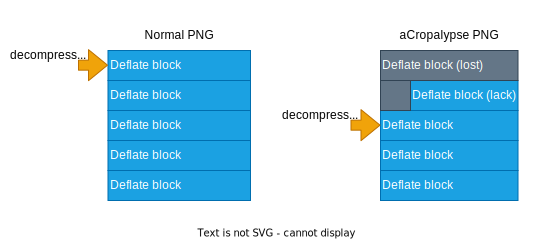

# aCropalypse GIF 脆弱性の詳細

## aCropalypseとは

aCropalypseは2023年3月に発見されたソフトウェア脆弱性です。`CVE-2023-21036`, `CVE-2023-28303` としても知られています。aCropalypse脆弱性のあるソフトウェアがファイルを上書きしたとき、あたかも正常に上書きされているように見えますが、実際には上書き前の情報が一部残ってしまいます。これによって、上書き前の情報から、たとえば画像の一部を復元できてしまう可能性があります。

たとえば、秘密情報 `Secret` を含む画像ファイルがあったとします。


これをaCropalypse脆弱性のあるソフトウェアで切り取って上書き保存します。画像表示上は、正しく切り取られ、上書き前の秘密情報は消えているように見えます。


しかし、この切り取り後の画像のみを使って特定のツールで操作すると、下記のような画像が得られます。


切り取っていたはずの秘密情報 `Secret` が復元できることがわかります。

本稿では、特にGIF画像において aCropalypse 脆弱性の影響を受けたファイルを復元する方法について解説します。

## aCropalypseのバイナリ構造

aCropalypse脆弱性のあるソフトウェアは、ファイルの上書き時に不正なバイナリを保存します。

上書き後のバイナリが上書き前のバイナリより小さい場合、上書き前のバイナリの一部がファイルに残ります。そのため、上書き前と上書き後のファイルサイズは同じになります。例えば、画像をトリミングして上書きした場合などに起こります。


このような不正なバイナリがある場合、以下の考慮が必要です。

- (1-a) 上書きしたバイナリと上書き前のバイナリの境界点は検知できるか？
- (1-b) 最初の方が欠損した上書き前のバイナリから、有益な情報を抽出することは可能か？

(1-a)は、一般的な画像バイナリでは簡単です。GIFとか。たいていの画像ファイル形式の仕様上、画像ファイルの末尾の仕様が明示されています。

(1-b) はファイル形式の仕様によっては難しいかもしれません。最初の方のバイナリが欠損しており、それがどこまで欠損しているかはわからないということは、そのファイルにとって重要な情報が抜けているかもしれません。しかし、PNGやGIF画像では欠損したバイナリから、画像の一部を復元が可能なことがわかっています。

## aCropalypse PNGの復元

PNGにおけるaCropalypseについては、発見者のブログで詳しく解説されています。see [Exploiting aCropalypse: Recovering Truncated PNGs](https://www.da.vidbuchanan.co.uk/blog/exploiting-acropalypse.html)。

PNGの画像データ圧縮に使われるDeflateでは、実装上、複数の圧縮ブロックが格納されていることが多いです。そのため、最初のいくつかの圧縮ブロックが欠損したとしても、どこかの最初の圧縮ブロックの位置を特定してしまえば、以降の圧縮ブロックが展開できると解説されています。



上記はPNGのDeflate固有の問題ですが、GIFにおいても似たようなアプローチで復元することが可能です。

## aCropalypse GIFの復元

### GIFの構造

aCropalypse GIFからの復元方法を理解するには、GIF画像のファイルフォーマット仕様の理解が必要です。GIFの仕様の正確な詳細は [GIF89a Specification](https://www.w3.org/Graphics/GIF/spec-gif89a.txt) や既存の解説サイトを読むことをおすすめします。ここでは、復元に必要なポイントに絞って説明します。

GIF画像のおおよその全体像は下記のとおりです。（説明のため、細かい厳密さは省いています）。

|name|size|explain|
|---|---|---|
|`Header`|6 byte|GIFであることを示すヘッダ `GIF87a` or `GIF89a` 固定。|
|`Logical Screen Descriptor`|7 byte|画像表示に関する各種情報|
|`Global Color Table`|0 to 256*3 byte|グローバルのパレットデータ|
|`Data`|n byte|画像データ|
|`Trailer`|1 byte|GIFの終端|

正常なGIFと、それを上書きした aCropalypse GIFのバイナリを比べると下記のようになります。


ここで、問題をより単純化するために、GIFが静止画であるケースのみを考えます。GIFが静止画のときと、GIFアニメーションの場合ではデータ構造が変わります。ほとんどの静止画GIFのDataは下記のようになります。（理解のしやすさのため、厳密な仕様から少し表現を変更しています）

|name|size|explain|
|---|---|---|
|`Graphic Control Extension`|8 byte|GIFアニメーションの情報|
|`Image Descriptor`|10 byte|1フレーム分の画像の情報|
|`Local Color Table`|0 to 256*3 byte|ローカルのパレットデータ|
|`Image Data`|n byte|LZW圧縮した画像データを サブブロック化したもの|

GIFアニメーションの場合、上記が複数繰り返されます。静止画の場合は1フレームしかないので、それぞれ1つしか格納されません。この性質により、GIFアニメーションのほうが復元が容易な場合があります。GIFアニメーションの場合は、欠損していない `Graphic Control Extension` の開始位置を探索すれば以降のデータの復元が可能になると思われますが、ここではそのケースは除外します。

GIF画像において、`Image Data` はサブブロックとして分割されます。これは、LZW圧縮したデータ全体を 255 bytesごとに分割するデータ構造です。1つのサブブロックは下記の構造になっています。

|name|size|explain|
|---|---|---|
|`Block Size`|1 byte|Data Valuesのサイズ|
|`Data Values`|(Block Size) byte|データ本体|

`Image Data`の中で、上記のサブブロックが複数繰り返されることになります。たとえば、LZW圧縮した画像データが 600 bytesだったとすると、下記の3つのサブブロックに分割されます。

- `0xFF` (Block Size / 1 byte) 0xFF = 255
- ... (Data Values / 255 byte)
- `0xFF` (Block Size / 1 byte) 0xFF = 255
- ... (Data Values / 255 byte)
- `0x5A` (Block Size / 1 byte) 0x5A = 90 = 600 - 255*2
- ... (Data Values / 90 byte)

2023年において、1つのサブブロックがたかだか255 bytesまでという仕様は疑問に思うかもしれません。ただ、これは現代よりもネットワークもコンピューターの性能も遥かに劣る時代に策定された1980年代に策定されたものなので、この程度のサイズが合理的だったのだと思われます（たぶん）。

### 通常のGIFデコード

GIFのデータ構造を理解したところで、通常の静止画GIFファイルをデコードする例を簡単に説明します。GIFデコードに関する文献はすでにたくさんあるので、より詳細にはそれらを参照するのがよいでしょう。

流れとしては下記です。

- `Header` からバイナリ列がGIF画像であるか検証する
- `Logical Screen Descriptor` 、 `Image Descriptor` から画像のサイズなどの情報を取得する
- `Image Data` のサブブロックを読み込み、サブブロックの `Data Values` を結合する
- `Data Values` を結合したデータをLZW展開する
- LZW展開したデータをインデックス画像として、`Global Color Table` または `Local Color Table` を元にRGB画像に変換する

よく知られているように、GIFはインデックスカラー画像の形式です。そのため、画像データを展開したそれはインデックス画像です。我々が普段目にするような画像として表示するためには、インデックスとパレットを組み合わせて、RGB画像に変換する必要があります。

### 復元のための4つの問題

さて、復元において重要なのはaCropalypse GIFにおいてどこからのデータが残存しているかです。上で説明した各データ構造のサイズを見ると想像できると思いますが、ほとんどの静止画GIFでは `Image Data` の途中からのバイナリが残存すると予測できます。それより上位のデータは、`Image Data` の大きさに比べて小さいからです。切り取った画像がとても小さい場合は、`Image Data` より前の情報が得られる可能性はありますが、確率は低いでしょう。

つまり、下記のようになります。


aCropalypse GIFから画像を復元するためには、最初の部分が欠けた `Image Data` だけを使うことになります。この欠けた `Image Data` から画像から復元するにあたって、問題は以下の4つに分割できます。

- (2-a) `Image Data` がどこから欠損しているかわからない
- (2-b) 一般的なLZW圧縮において、先頭のバイナリが欠けると展開できない
- (2-c) 画像のサイズがわからない
- (2-d) パレットの情報が欠損している

逆に言うと、上記の問題が解決できれば、画像が復元できるということです。それぞれ考えてみましょう。

#### (2-a) Image Dataがどこから欠損しているかわからない

`Image Data` がどこから欠損しているかわからないのは明白ですが、これはどのような問題を引き起こすでしょうか？

少し前に `Image Data` のサブブロックの説明をしましたが、LZW展開するためには、 `Block Size` のバイナリを取り除き、 `Data Values` のみを結合したバイナリが必要です。先頭が欠損した `Image Data` では、どれが `Block Size` でどれが `Data Values` なのかは単純にはわかりません。

ただ、ある程度大きなGIF画像においては、`0xFF` の `Block Size` となるサブブロックが連続していることが予測できます。そのため、まずは `0xFF` のバイトを探索します。当然 `0xFF` のバイナリは `Data Values` の中にも出現するので、単一の `0xFF` からはそれが `Block Size` であることを特定できません。しかし、 サブブロックの性質上、それが `0xFF` の `Block Size` であった場合、その次の `0xFF` bytes を読み込んだ更に次のバイトは `0xFF` である可能性がかなり高いです。これを繰り返し読み込みを行い、`Trailer` に到達するまで不整合がなければ、最初に見つけた `0xFF` は `Block Size` であると予測できます。


上記の方法により `Block Size` が特定できれば、`Data Values` を結合し、欠損したLZW圧縮バイナリを得られます。

ちなみに、探索方法はこれ以外にもあると思います。たとえば、Trailerからさかのぼって整合性を検証することも可能だと思います。今回は試してません。

#### (2-b) 一般的なLZW圧縮において、先頭のバイナリが欠けると展開できない

さて、一般的には、先頭のバイナリが欠損したLZW圧縮バイナリを展開することは事実上困難です。

LZW圧縮についての説明は難しいので詳細は既存のサイトを読むことをおすすめします。簡単に言うと、LZWはバイナリ列を順番に読み込みながら辞書データを作成していくことになります。最初のバイナリ列によって辞書の内容が変わるので、最初のバイナリが欠損すると全く異なるデータになってしまいます。また、展開時はビットレベルの操作をするのですが、読み込むビットサイズもデータの内容によって変動するので、どの位置が境界になっているのかすら特定ができません。

しかし、GIFのLZW圧縮はいくつか追加の仕様があります。GIFのLZW圧縮の性質で重要なのは下記です。

- 辞書のコードの最大長は12bit（4095個）
- 辞書のコードが4095個を超えるとき、 `クリアコード` を出力し、辞書を初期化する


LZW圧縮の仕様上、辞書というものが作られます。辞書データを参照することで、より小さなデータに圧縮できます。ただ、単純に辞書を作ると無制限に増えます。GIFでは、この辞書の最大長が定められており、それが満杯になったとき、`クリアコード` という特殊なコードを出力し、辞書を初期化します。辞書が初期化された後のバイナリ列は、その前にどのような辞書が作られていたかは関係なく、新規にLZW展開できます。

LZW圧縮の仕様を把握していないとこれらの理解は難しいと思うのですが、要は **クリアコードの位置さえ特定できれば、それ以降はLZW展開できる** ということです。LZW圧縮バイナリ全体のうち最初のバイナリが欠損していても、クリアコード以降のバイナリはLZW圧縮した別のバイナリとみなせるため、LZW展開が可能です。辞書が満杯になったときのクリアコードは、多くの場合ビット列で `0b0001_0000_0000` です。

なお、厳密にはクリアコードは画像の色深度によって変わりうることには注意してください。現代においては色深度8bitのGIFがほとんどのはずです。色深度8bitのGIFでは、クリアコードが256になります。


クリアコードのビット値を推定したあとは、欠損したLZW圧縮バイナリを1bitずつずらしながら、クリアコードの値を探索するだけです。クリアコードと一致するビット列以降をLZW圧縮データとみなし、LZW展開に成功すれば、それは画像データである可能性があります。実際には偶然にもLZW展開可能なバイナリ列になることも多いですが、展開後のデータが十分大きければ（たとえば、展開前のデータより大きければ）、それは復元したい画像データである可能性が高いです。

#### (2-c) 画像のサイズがわからない

画像のバイナリを処理することに慣れている人ならよく知っていると思いますが、画像データはそのものは1次元配列です。得られた1次元配列を元に、画像サイズに合わせて表示しているだけです。画像データだけでは、どこからが次のラインかはわかりません。少なくとも横幅の情報がないと、どこで次のラインに行っていいのかわかりません。

`acropalypse-gif restore` では元画像のサイズを入力してもらっているので、実はこの問題は解決していません。しかし、解法はあると考えます。

切り取り後の画像のデータ列がわかっているので、復元後のデータ列でマッチするところを探せば、元画像のサイズは特定可能です。もちろん、元になったデータが単純な塗りつぶしや規則的なデータだった場合探索できない可能性はありますが、一般的なGIF画像であればまず間違いなく特定可能でしょう。

#### (2-d) パレットの情報が欠損している

LZW展開できたデータは、GIFのインデックス画像データです。これを人間の目に見える形にするには、パレットデータが必要です。しかし、パレットデータはロストしています。

ただ、これは他に比べると些細な問題です。パレットデータがなくても、インデックスデータがあれば形状の推定は可能です。適当なパレットを用意して当てはめれば、再現はしなくてもおおよその形状はわかります。もし画像内にパスワードのような文字列が含まれていたとすれば、正確な色は重要ではありません。形状さえわかれば、パスワードの文字列は特定可能でしょう。

より高度な手法としては、切り取った後のパレットとその画像データから推定する方法が考えられます。もし復元できたデータ内に切り取り後のデータ列が含まれていれば、その部分のパレットが対応するはずです。 `acropalypse-gif restore` ではそこまで処理していないので、復元後の画像は色がおかしくなっていますが、あまり問題はないことがわかるでしょう。

### 復元アルゴリズム

上記をまとめると、aCropalypse GIFを復元するアルゴリズムは下記です。

- `Image Data` のサブブロックを探索する. サブブロックは `0xFF` で始まり、GIFフォーマットに従っているか検証が可能.
- GIFのLZW圧縮における12bitのクリアコードを探索する。これは  `0b000100000000` のビット列.
  - 上記のクリアコード以降のバイナリをLZW展開する
- 切り取った画像の情報から、元画像の横幅を推定する
- 切り取った画像のパレットを使って、画像の色を復元する

## aCropalypse画像の検出と修正

`CVE-2023-21036` や `CVE-2023-28303` によって現在 aCropalypse な画像を出力するソフトウェアの脆弱性は修正されています。しかし、インターネット上に公開されているあなたの画像はaCropalypseな画像かもしれません。

現実的な対策として、手元のaCropalypseな画像を補正しておくことはできます。基本的には、疑わしい画像があれば再保存するだけで良いです。これは画像をアップロード可能なWebサービス等でもよく行われている画像の脆弱性の対策になります。

PNGの場合は、IENDのバイナリが複数ある場合、aCropalypseな画像である可能性が高いです（画像データに偶然IENDと一致するデータが含まれる可能性もあります）。

```sh
$ strings acropalypse.png | grep IEND
IEND
IEND
```

より安全な方法として、[infobyte/CVE-2023-21036](https://github.com/infobyte/CVE-2023-21036) を使うのもよいでしょう。

GIFの場合は、`Trailer` が1バイトしかないので、PNGのように単純にはできません（直前の 0x00を含めても2バイトです）。`Trailer` と同等のバイナリ列が画像データに含まれている可能性は高いです。そのため、画像ファイルがあったとき、`Trailer` までGIF画像として読み込み、その後さらにバイナリ列が続いているかを判定する必要があるでしょう。この処理は `acropalypse-gif detect` として実装しています。

```sh
$ acropalypse-gif detect asset/case01_crop.gif
asset/case01_crop.gif
```

aCropalypse GIFかどうかわざわざ判別せず、一律すべての画像を再保存してしまうのも手だと思います。これはJPEGでも同様で、疑わしいJPEGがあれば再保存することをおすすめします。

なお、外部に公開していた画像が誰かにすでにダウンロードされている可能性も否定はできません。自身で復元を試みて、秘密情報が含まれているようであれば、その秘密情報は流出した可能性があります。それがもしパスワードなのであれば、パスワードの変更が必要となるでしょう。

### GIF/PNG　以外のaCropalypse影響

aCropalypse自体は、GIF/PNGに限らずファイル上書き時に元のバイナリの一部が残ってしまう脆弱性です。

2023/3時点で残ったバイナリからの復元の実証がされているのは GIF と PNG だけですが、それ以外のバイナリについて復元されないという保証はありません。たとえばJPEGでの復元はおそらく困難ですが、将来何らかの有益な情報が得られる可能性を否定できません。色の完全な復元は無理だったとしても、パスワードの文字の形状や特徴が抽出可能な方法が存在するかもしれません。

切り取り前の余分なバイナリの一部を残しておくことはセキュリティ上のリスクです。そのため、どんなバイナリフォーマットであれ、aCropalypseの影響を受けたファイルは、保存し直すことをおすすめします。

## まとめと補足

本稿では、aCropalypseの影響を受けたソフトウェアで保存されたGIF画像の復元について述べました。**aCropalypseと同様の問題はおそらく将来も起こりうること** です。まだ見つかっていないだけで、既存のソフトウェアにも同様のバグが潜んでいるかもしれません。特定のバイナリフォーマットを出力したとき、上書き時に同様のバグをはらんでいる可能性を簡単には否定できません。

ファイル上書き時というやや限定された状況にしか発生しないため、ファイル書き込みのテストケースから漏れている可能性があります。ただ、これを読んでいるあなたは、aCropalypseの問題について詳しくなったので、ちゃんと **テストケースの一つにして同様の問題を防ぐ** ことができるでしょう。

さらに、この脆弱性の発見が遅れたのは、画像ビューアーなどの **読み込み側のチェックが甘い** というのも一因と考えられます。aCropalypseというバグ自体は、ファイル出力したソフトウェアの問題ではありますが、読み込む側のソフトに責任がなかったわけではないでしょう。画像を読み込むソフトウェアからすると、バイナリファイルが多少変な状態であっても、ファイルが表示できることを重視しがちです。現に、aCropalypseのGIFをWebブラウザやビューアーで普通に表示でき、なにか警告がでることもありません。ちゃんとチェックするのは面倒だし、場合によってはユーザー体験を損ねるので気持ちはすごくわかります。が、異常なファイルを読み込んだとき、警告を出すビューアーがもしも今より多ければ、今回の脆弱性はより早い段階で気がつけたかもしれません。

何らかのバイナリファイルを書き込むソフトウェアも、読み込むソフトウェアも、今回の脆弱性を教訓に、それぞれ今よりも少しだけ気にすることで、バイナリファイルにまつわる将来の脆弱性を減らすことができるのではと考えます。
